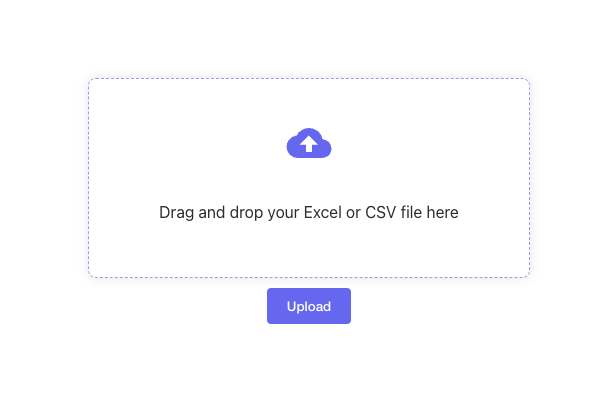

## @deepalilodhi/react-bulk-upload-1
A versatile React component for uploading CSV files with a user-friendly interface, supporting both button click and drag-and-drop functionalities.

## Installation
Install the package using npm:

```
npm install @deepalilodhi/react-bulk-upload-1@1.9.0
```
- Supportive package
```
npm install axios
npm install react-dropzone
```

## Usage
Import the Button component in your React application:

```
import { Button } from '@deepalilodhi/react-bulk-upload-1';
<Button buttonName={'Upload'} uploadUrl={"/your-url or api route"}/>
```


## Features

- User-Friendly Interface: Provides an intuitive button for file upload.
- Drag-and-Drop Support: Allows users to drag and drop files into the designated area.
- Customizable: Easily customize the button text and define the upload URL.
- Example



## Props
- buttonName (required)
Type: string
Description: The text to be displayed on the upload button.
- uploadUrl (required)
Type: string
Description: The URL where the uploaded file will be sent.

## Contributing
Feel free to contribute by opening issues or submitting pull requests on [@deepalilodhi/react-bulk-upload-1](https://github.com/Deepali-1508/-deepalilodhi-react-bulk-upload-1). Please follow our Contribution Guidelines.

## License
This project is licensed under the MIT License - see the LICENSE.md file for details.
